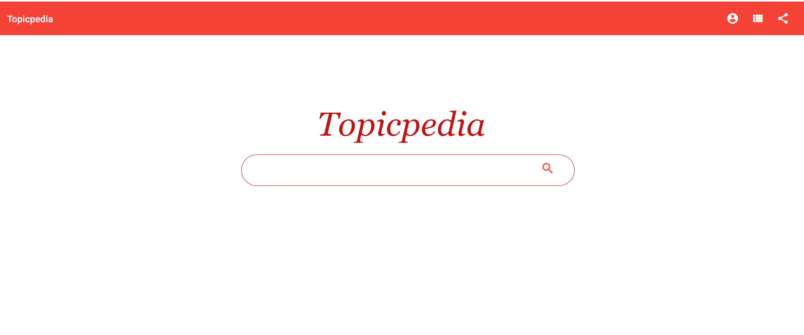
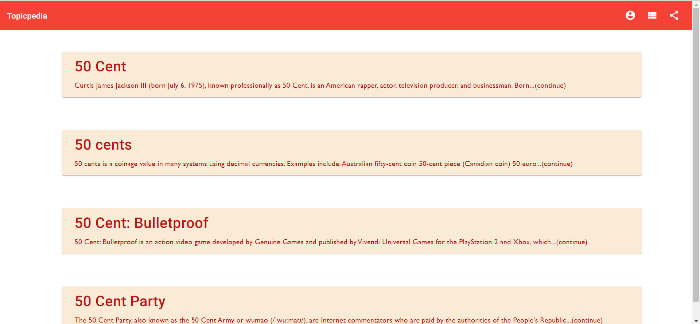
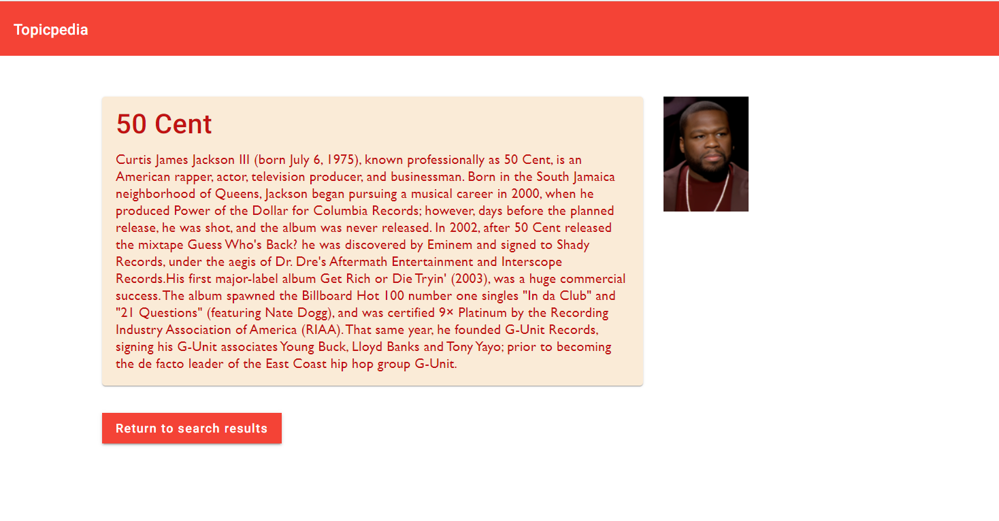

# 
This project was generated with [Angular CLI](https://github.com/angular/angular-cli) version 15.2.6 and [Spring Boot](https://start.spring.io) version 2.7.13

## Description
Topicpedia is Search engine application that is designed to help users find information on the internet.
When a user enters a search query (topic), Topicpedia quickly scans its index of web pages to find the most relevant and useful results

## Technology Stacks

- Java
- Angular 15
- Angular Material
- Spring Boot
- Typescript
- Nginx server
- HTML
- Boostrap
- CSS
- NodeJS
- Docker
- Kubenetes
- AWS EKS
- AWS EC2
- TLS/SSL (self singed certificate)
## Environment:
    -Spring boot Framework
    -JDK 17
    -IntelliJ
    -VS Code

## Components
### HomepageComponent
-> This component contains the home page: the first thing the user sees on the site

This is the home page where users can enter topic as input.

### Search Topic Component

This page displays the list of search results for users after a topic is enter in the search bar.

### Topic-Page Component

-> This page provides full details of a specific topic/title from the search result list.

## Getting Started
### Local environment set-up
- git clone `https://github.com/Keoffor/topicpedia-frontend.git` and move into its folder
- Run `npm install -g @angular/cli` to install the Angular CLI
- cd to the project folder - topicpedia
- Run `npm install` to install all dependencies.
- Run `npm start` to launch project and hit on the provided url link `http://localhost:4200/`. to lanuch the app in your browser.
- Create a new folder for the backend repo, move into this folder, and run git clone `https://github.com/Keoffor/topicpedia-backend.git`

- Open your favorite IDE and run the topicpedia-backend service

# Topicpedia Backend Service

## Overview

Topicpedia-backend Service is responsible for handling all requests from the frontend client app. When users interact with the client app, it returns response to client based on the input.

## Technologies

- Java (v.17)
- Spring Boot
- Lombok
- JUnit
- Slf4J
- Maven
- Wikipedia API
- JUnit4
- Mockito
- Lombok
- Docker
- Kubernetes

## Getting Started with Topicpedia-backend

1. Clone repo from `https://github.com/Keoffor/topicpedia-backend.git`

2. Open in IDE of your choice to launch the service in port 8080

## Accessing the Application on the Internet
Users can access the app on the internet using this url - [topicpedia](https://topicpedia.kendoc.vip) `https://topicpedia.kendoc.vip`

The app is deployed on https with an Nginx Ingress Controller. A self signed Certificate was used for the TLS data encrpytion configuration.

`Note:` The infrastructure used to deploy this app on the internet is personal managed hence it may not running at all times as a production grade infrastructure. 

